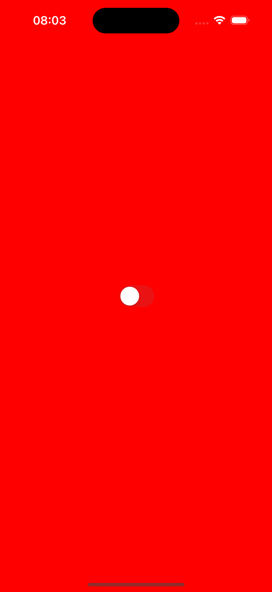
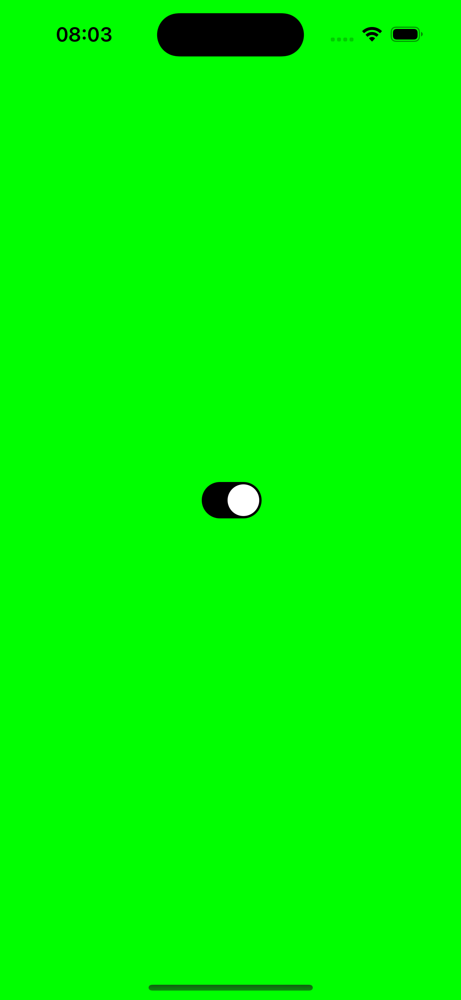

# 🎛️ UISwitch Background Color  

Um aplicativo iOS simples desenvolvido em Swift, utilizando `UISwitch` para alterar a cor de fundo dinamicamente.  

## 📌 Sobre o Projeto  
Este projeto demonstra o uso do `UISwitch` no UIKit para modificar a interface do usuário de forma interativa. Quando o switch é ativado ou desativado, a cor de fundo da tela muda:  

✅ **Switch ON** → Fundo verde  
❌ **Switch OFF** → Fundo vermelho  

## 🚀 Tecnologias Utilizadas  
- **Linguagem:** Swift  
- **Framework:** UIKit  
- **IDE:** Xcode  

## 📷 Demonstração  
| Switch OFF | Switch ON |
|------------|----------|
|  |  |

## 🛠️ Como Executar o Projeto  
1. Clone este repositório:  
   ```bash
   git clone https://github.com/Mikaelmendonca/UISwitch-Background.git
